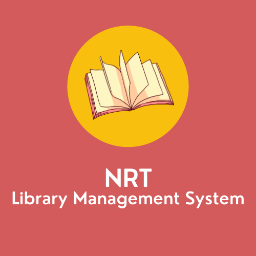

[![Contributors][contributors-shield]][contributors-url]
[![Repo size][repo-size-shield]][repo-url]
[![LinkedIn][linkedin-shield]][linkedin-url]
[![MIT License][license-shield]][license-url]

<!-- PROJECT LOGO -->
 

    
  <h3 align="center">NRT Library Management System</h3>

  

  Kişisel kütüphanenizi organize etmeniz için geliştirilmiş bir kütüphane yönetim sistemi
        
  

<!-- TABLE OF CONTENTS -->

## İçerik tablosu

- [Geliştirici Hakkında](#geliştirici-hakkında)
- [Proje Hakkında](#proje-hakkında)
  - [Modeller](#modeller)
    - [Kitaplar](#kitaplar)
  - [Entity-Relationship Diagram](#entity-relationship-diagram)
  - [Built With](#built-with)
- [Getting Started](#getting-started)
  - [Prerequisites](#prerequisites)
  - [Installation](#installation)
- [Contributing](#contributing)
- [License](#license)

<!-- GELİŞTİRİCİ HAKKINDA -->

## Geliştirici Hakkında

<a href="https://linkedin.com/in/nurettin-resul-a3a0141a7">

Nurettin Resul Tanyıldızı

</a>

NRT Library Management System [Nurettin Resul Tanyıldızı][linkedin-url] tarafından geliştirilmiştir.

<!-- ABOUT THE PROJECT -->

## Proje Hakkında

NRT Library Management System bir kişisel kütüphane yönetim sistemidir. Bu sistem sayesinde kişiler, kendileri adına oluşturdukları kütüphanelerine, düzenli, estetik ve modern bir biçimde istedikleri kitapları ekleyebilir ve kütüphanelerini kolaylıkla yönetebilirler.

- NRT Library Management System kütüphanesini dijital ortamda oluşturmak isteyen insanlara eğlenceli bir deneyim sunar.
- Estetik ve kullanıcı dostu arayüzü sayesinde kişiler kütüphanelerini yönetirken asla zorlanmaz ve aradıklarını kolaylıkla bulabilirler.

Sistem başlıca beş farklı yapıdan/modelden oluşmaktadır. Kullanıcılar bu yapıları/modelleri istedikleri şekilde yönetebilirler.

### Modeller

#### Kitaplar

- Kitaplar bir kütüphanenin olmazsa olmazıdır. NRT LMS ile kütüphanenize kullanıcılar istedikleri kitabı kütüphanelerine kolaylıkla ekleyebilir, güncelleyebilir ve silebilirler.

- Kitaplar, **isim**, **dil**, **yayınlama tarihi**, **baskı sayısı**, **sayfa sayısı**, **kitap açıklaması**, **kitap boyutları (yükseklik ve genişlik)**, **kapak resmi** gibi başlıca bilgiler barındırırlar. Bu sayede kullanıcılar kütüphanelerine ekledikleri kitaplar hakkında detaylı bilgiler edinebilirler. Bu bilgilerden yalnızca **kitap ismi**ni girmek sistem tarafından zorunlu tutulmaktadır. Diğer tüm bilgiler kullanıcıların isteğine göre tamamen ya da daha sonra değiştirilmek üzere boş bırakılabilirler.
- Bu bilgilerin yanı sıra, kitaplara, **yazar** veya **yazarlar**, varsa **çevirmen**, yayımlandığı **yayınevi** ve **kategori** gibi ek bilgiler de eklenebilmektedir. Önceden bahsedilen diğer bilgiler gibi bu bilgilerin de hiçbirinin eklenmesi zorunlu değildir. Bir kitabı eklemek için gereken tek bilgi kitabın ismidir. Bu sayede kitap eklemek çok kolaydır ve kitaplar rahatlıkla güncellenebildiği için kullanıcılar eklemek istedikleri herhangi bir bilgiyi daha sonra da ekleyebilirler.
- Kullanıcılar kitapları beğenisine göre değerlendirebilsin diye, her kitapla ilişkilendirilmiş bir **skor** değeri vardır. Bu skor değeri sıfır ile beş arasında değişmektedir ve tüm kitapların skorları varsayılan olarak sıfırdır. Kullanıcılar istedikleri zaman kitaplarının skorlarını değiştirebilir ve beğendikleri kitapları ön plana çıkarabilirler.

#### Notlar

- Yazarlar
- Yayın evleri
- Kategoriler

Here's why:

- Your time should be focused on creating something amazing. A project that solves a problem and helps others
- You shouldn't be doing the same tasks over and over like creating a README from scratch
- You should element DRY principles to the rest of your life :smile:

Of course, no one template will serve all projects since your needs may be different. So I'll be adding more in the near future. You may also suggest changes by forking this repo and creating a pull request or opening an issue.

A list of commonly used resources that I find helpful are listed in the acknowledgements.

### Built With

This section should list any major frameworks that you built your project using. Leave any add-ons/plugins for the acknowledgements section. Here are a few examples.

- [Bootstrap](https://getbootstrap.com)
- [JQuery](https://jquery.com)
- [Laravel](https://laravel.com)

### Entity-Relationship Diagram

![Entity-Relationship Diagram][erd-screenshot]

<!-- GETTING STARTED -->

## Getting Started

This section will be updated.

### Prerequisites

This section will be updated.

### Installation

This section will be updated.

<!-- USAGE EXAMPLES -->

## Usage

This section will be updated.

<!-- LICENSE -->

## License

Distributed under the MIT License. See `LICENSE` for more information.

[repo-url]: https://github.com/rtanyildizi/Library-Management-System/
[contributors-shield]: https://img.shields.io/github/contributors/rtanyildizi/Library-Management-System
[contributors-url]: https://github.com/othneildrew/Best-README-Template/graphs/contributors
[repo-size-shield]: https://img.shields.io/github/repo-size/rtanyildizi/Library-Management-System
[license-shield]: https://img.shields.io/github/license/rtanyildizi/Library-Management-System
[license-url]: https://github.com/rtanyildizi/Library-Management-System/blob/main/LICENSE
[linkedin-shield]: https://img.shields.io/badge/-LinkedIn-grey
[linkedin-url]: https://linkedin.com/in/nurettin-resul-a3a0141a7
[erd-screenshot]: images/nrt-lms-erd.png
[developer-image]: images/profile_circle.png
